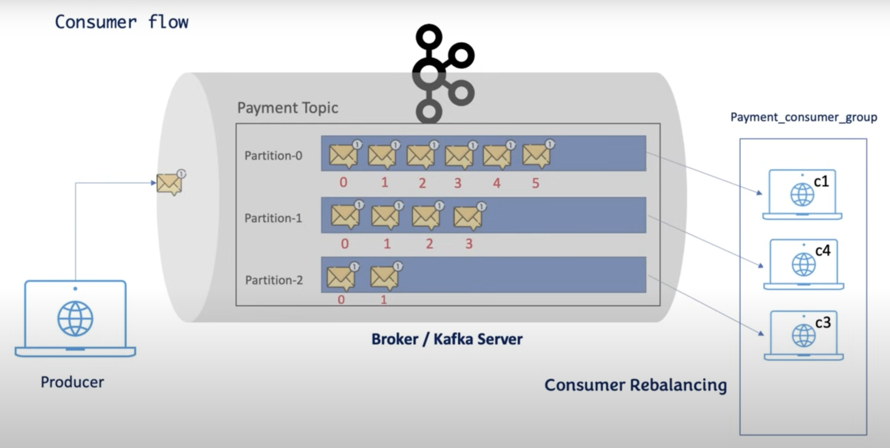

# Kafka Consumer group
A Kafka consumer group is a set of consumers that work together to consume messages from one or more Kafka topics in parallel, ensuring that each partition is consumed by only one consumer within the group. This enables load balancing and fault tolerance, as Kafka automatically distributes partitions among available consumers in the group.  
This project has implementation of kafka consumer group in Java


## Kafka consumer group flow:


## Prerequisite
- Java 17
- Spring Web dependency
- Spring Kafka dependency
- Zookeeper
- Kafka 

## Installation and Usage
 Make sure that kafka is running locally. Follow the steps mentioned in [Github](https://github.com/VrushaliJalgaonkar/kafka-cli-practice)  

### 1. Clone the Repository

Clone the repository to your local machine using the following command:

```bash
git https://github.com/VrushaliJalgaonkar/kafka-consumergroup.git
```

### 2. Navigate to the Project Directory

Move into the project directory:

```bash
cd kafka-consumergroup
```

### 3. Run application using,
```bash
./mvnw spring-boot:run
```

